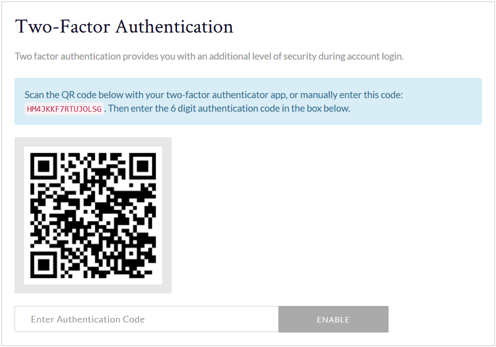

# Yii 2 - Two Factor Authentication

This is an extract of code from an application I built in Yii 2. It demonstrates a Two Factor Authentication (2FA) feature.

An overview of the files is as follows:

   - [`controllers/AuthController`](controllers/AuthController): This contains the action to receive the form post that includes the 2FA code
   - [`controllers/SettingsController`](controllers/SettingsController): This contains the actions that allow the user to view, enable and disable 2FA
   - [`models/LoginForm`](models/LoginForm): This contains the logic to process and validate the 2FA login form
   - [`services/TwoFactorQrCodeUriGeneratorService`](services/TwoFactorQrCodeUriGeneratorService): This contains the logic to generate a 2FA QR code
   - [`validators/TwoFactorCodeValidator`](validators/TwoFactorCodeValidator): This contains a custom validator that performs the 2FA code validation
   - [`views/authenticate.php`](views/authenticate.php): This contains the form where the user will enter the 2FA code (screenshot below)
   - [`views/two-factor.php`](views/two-factor.php): This contains the form that allows the user to view, enable and disable 2FA

